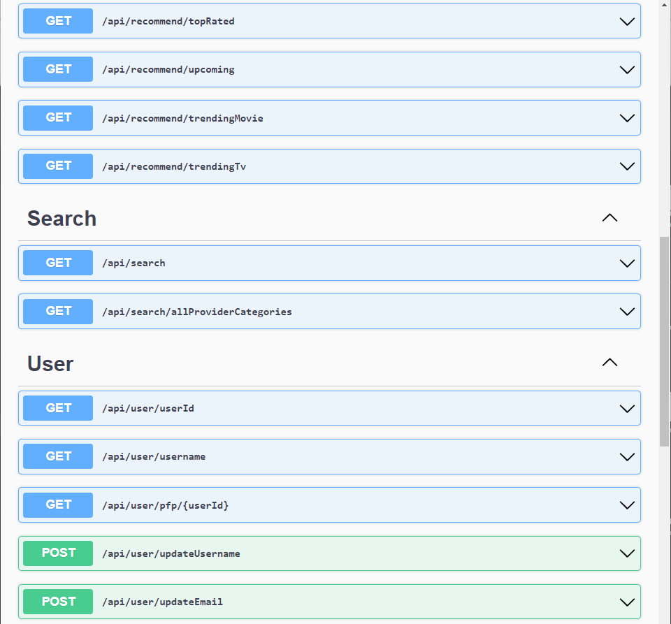

 

  
  <h3 align="center" style="margin-top:0;">nalozi.si ASP.NET API</h3>

<!-- ABOUT THE PROJECT -->
## About The Project

Frontend: [nalozisi-angular](https://github.com/lanlebar/nalozisi-angular)

Torrent search platform build with Angular on the frontend and ASP.NET on the backend. PostgreSQL database.
Features:
-  User registration and login system
    -  Hashing passwords with BCrypt
    - Authentication using JWT
    - System of regular and users and admins
- Torrent search using [torrent-search-api](https://www.npmjs.com/package/torrent-search-api)
    - Search torrents from ThePirateBay, YTS or TorrentProject
- Explore movies and series - data provided by [TMDB API](https://www.themoviedb.org/)
    - I'm feeling lucky functionality
    - Movie/series of the day (set by admins then visible to other users)

Project is not published.

## Backend

Web API built with ASP.NET. Using PostgreSQL as a database with EF Core.

API routes:

## License

Distributed under the MIT License. See [`LICENSE.txt`](LICENSE.txt) for more information.

## Contact

Lan Lebar - [LinkedIn](https://www.linkedin.com/in/lan-lebar) - lanlebar6@gmail.com

Project Link: [https://github.com/lanlebar/nalozisi-api](https://github.com/lanlebar/nalozisi-api)

(<a href="#readme-top">back to top</a>)

